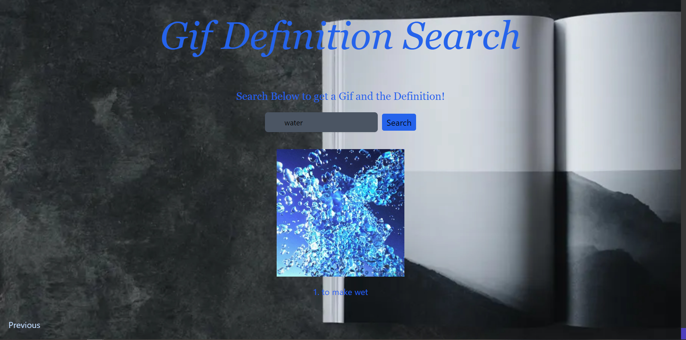

# Giphy Definition Search

This application is designed to make searching for definitions fun and exciting!

The user inputs a specific word they are curious about the definition for and recieve back a related gif and definition.
The user can then enter a new word and get a new definition

## Features

- Search Box for searching for various words
- Gif related to that word
- Dynamic Styling using Tailwind CSS

## Screenshot

## APIS Used

- [Dictionary API](https://www.dictionaryapi.com)
- [Giphy API](https://api.giphy.com)
## Authors

- [Erhan belanger](https://www.github.com/erhanbelanger)
- [Marcos Collado](https://www.github.com/S3kiro24)
- [Anthony Adamson](https://www.github.com/anthonyaadamson)